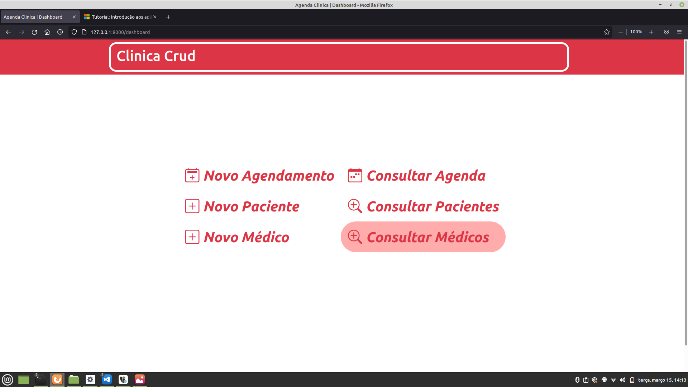
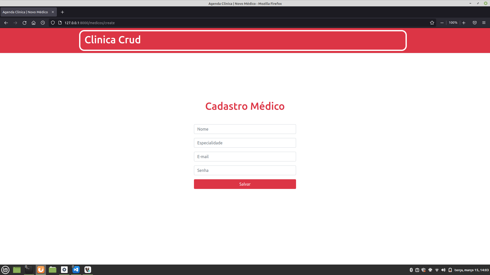
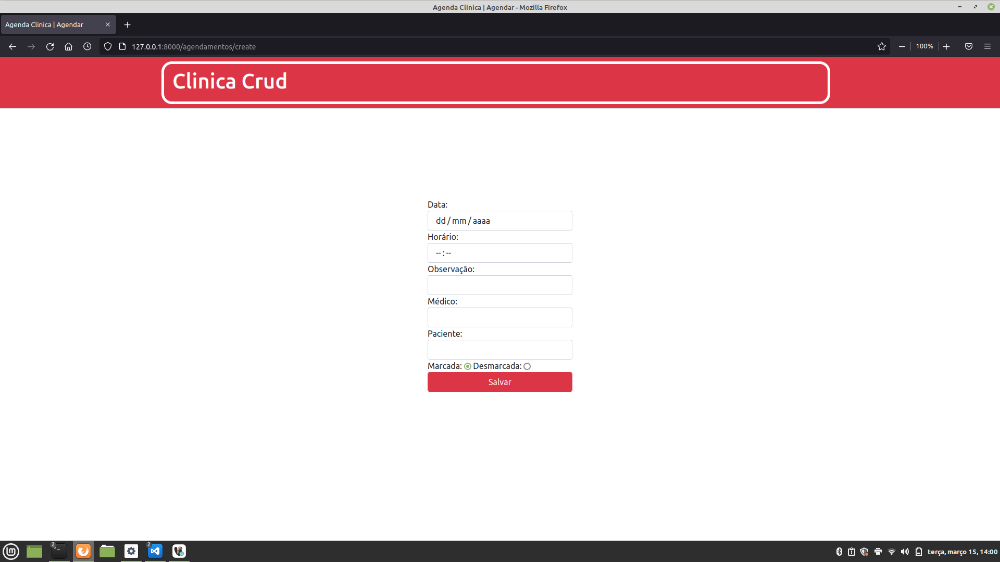
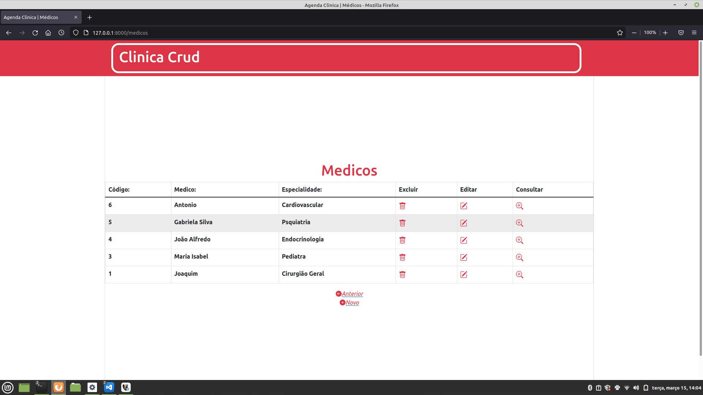

# Laravel Boilerplate

## Versões

As versões dos frameworks e pacotes:

- Laravel Framework 8.80.0
- PHP 8.0.14
- Bootstrap 5.1
- jQuery 3.6.0
- Sweetalert 2
- Bootstrap Icons 1.7.2

## Começando

As instruções a seguir vão adicionar uma cópia do projeto na sua máquina local para testes e desenvolvimento.

### Pré-requisitos

- Você precisa dos seguintes serviços instalados no seu computador:

```
GIT
PHP ^8.0
MySQL
Composer (https://getcomposer.org/)
```

### Instalando

- Primeiramente é necessária uma base de dados, para isso é preciso criar uma:

```
CREATE DATABASE consultamedica;
GRANT ALL PRIVILEGES ON laravel . * TO 'seu_usuario'@'localhost';
```

- Clone o projeto para sua máquina (coloque na pasta do seu servidor WEB):

```
git clone https://github.com/eduardoplnascimento/laravel-boilerplate.git
```

- Configurar o arquivo .env com as suas informações do banco de dados:

```
DB_CONNECTION=mysql
DB_HOST=127.0.0.1
DB_PORT=3306
DB_DATABASE=laravel
DB_USERNAME=seu_usuario
DB_PASSWORD=sua_senha
```

- Rodar o comando para instalação (pode demorar alguns minutos):

```
composer install
```

- Rodar o comando para gerar a chave do Laravel:

```
php artisan key:generate
```

- Rodar os comandos para migrar o banco de dados com alguns dados de teste:

```
php artisan migrate
```

### Abrir o servidor backend

- Para rodar o servidor backend utilize o comando:

```
php artisan serve
```

## Utilização

- Acessando a URL do projeto, você será direcionado para a página de *login*:

Para primeiro acesso deve-se clicar em Registrar, e informar os dados do novo médico

- A partir, feito o cadastro ou o login, será redirecionado para a página inicial (*dashboard*) :



- Ao clicar nas opções de cadastro, será redirecionado para criar um novo médico, novo paciente, ou novo agendamento.





- E nas telas de visualização há as opções para voltar, editar o registro, visualizar e excluir o registro.




